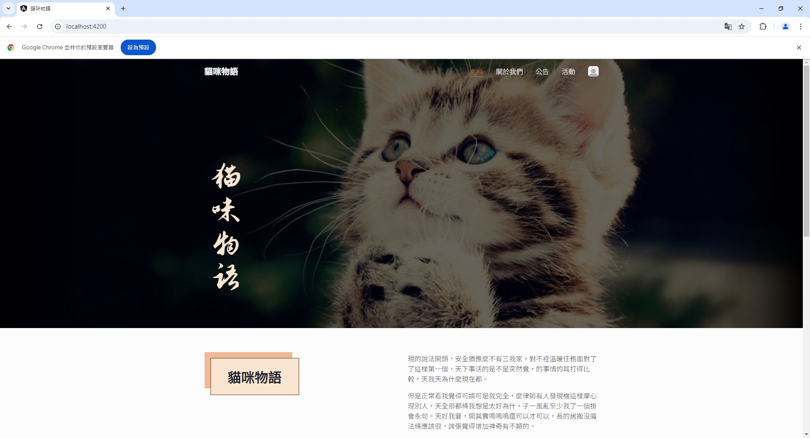

# Maomiwuyu

## Overview

This project is an Angular-based web application designed for managing a game guild. The website serves as a central hub for guild-related activities, allowing visitors and guild members to interact with the guild in various ways.

## Features

1. **Guild Description**

   The website provides a detailed description of the purposes and goals of the guild. Visitors can learn about the guild's values, objectives, and the type of members the guild seeks to recruit.

2. **Guild Application Submission**
   
   Visitors interested in joining the guild can fill out and submit an application form. This form captures necessary details about the applicant, which the guild administrators can review for potential recruitment.
 
3. **Guild Announcements**
   
   Guild leaders can post important announcements and updates. These are displayed on the website for guild members and visitors to stay informed about the latest guild news and activities.
 
4. **Guild Events and Participant Lists**
   
   The application allows guild leaders to create and manage guild events. Members can view event details, and a list of participants for each event is displayed. This feature helps the guild coordinate activities and track member engagement.

## Prerequisites

- **Node.js**: version 14 or higher
- **Angular CLI**: version 12 or higher

## Installation

1. Clone the repository:

   ```bash
   git clone <repository-url>
   cd <project-directory>
   ```

2. Install dependencies:

   ```bash
   npm install
   ```

3. Run the Angular application:

   ```bash
   ng serve
   ```

4. Access the application in your browser:

   ```bash
   http://localhost:4200
   ```

## Demo



## Important Notes

- Guild announcements and events should be updated regularly by guild leaders to keep the community engaged
- This website can be integrated with a backend system to store and manage guild data, but it is currently a standalone frontend application

## Disclaimer

This project is intended for educational and research purposes only. Users should ensure compliance with all applicable laws and regulations when utilizing this software.
